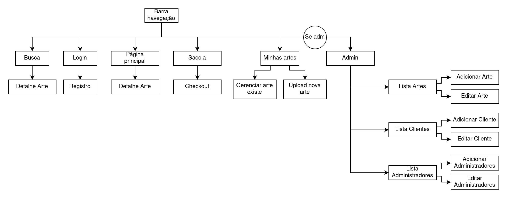

O mundo está repleto de artistas online com obras maravilhosas. No <b>ArtOnline</b> você pode acompanhar o trabalho bem de perto, você pode comprar artes virtuais e exibir para todo o mundo em nossa plataforma sua incrível coleção. Ou pode apostar em artistas emergentes e ganhar dinheiro revendendo arte.

Venha para o ArtOnline, entre no mundo da arte!

**Grupo:**\
Breno Cunha Queiroz - 11218991\
Francisco de Freitas Pedrosa - 11215699\
Thales Willian Dalvi da Silva - 11219196

## Sumário
- [1.Requisitos](#1-requisitos)
- [2.Descrição do projeto](#2-descrição-do-projeto)
	- [2.1.Diagrama de Navegação](#21-diagrama-de-navegação)
	- [2.2.Dados no Servidor](#22-dados-no-servidor)
- [3.Comentários sobre o código](#3-comentários-sobre-o-código)
- [4.Plano de teste](#4-plano-de-teste)
- [5.Resultado dos testes](#5-resultado-dos-testes)
- [6.Procedimentos para executar](#6-procedimentos-para-executar)
- [7.Problemas](#7-problemas)
- [8.Comentários](#8-comentários)

## 1. Requisitos
Abaixo vamos apresentar requisitos adicionais específicos para o sistema do ArtOnline.
- Deve ser possível que um cliente adicione uma arte digital para venda.
- Na primeira vez que a arte é adiciona ao site, deve se especificar a quantidade de cópias disponíveis.
- Quando um cliente compra uma arte digital, ele deve ganhar a posse sobre a quantidade que ele comprou.
- Deve existir uma página para gerenciar as artes digitais já compradas ou criadas.
- Cada arte digital em nome de um cliente pode, ou não, estar disponível para venda.
- Deve ser possível clicar no produto para vê-lo em maior resolução.
- Cada cliente possui um link público com todas as artes que tem posse.
- O cliente deve saber o total de dinheiro que conseguiu ganhar com suas artes.

## 2. Descrição do projeto
O ArtOnline um sistema onde pessoas podem comprar e vender artes digitais. Após realizado o cadastro, cada cliente pode comprar uma arte de outro usuário, ou adicionar artes próprias. 

Se o cliente X decidir compra uma arte de outro cliente Y, ele deve entrar na página de detalhes da arte em questão, selecionar a quantidade, e adicionar à sacola. Após isso, o usuário pode processeguir para o checkout, onde insere os dados do cartão (não irá precisar ser dados reais) e finaliza sua compra. Quando isto acontecer, irá diminuir a quantidade de artes disponíveis do cliente Y, e o cliente X terá a quantidade comprada adicionada em seu nome (outra instância no banco de dados).

Se o cliente decidir por realizar um upload, ele deve selecionar um arquivo de imagem, escolher um nome, preço, e total de cópias disponíveis. O sistema irá garantir que nunca irá existir mais cópias do que o especificado inicialmente. Após isto, esta arte estará disponível para outros clientes comprarem.
Vale ressaltar que não irá existir um sistema de retirada do dinheiro, nem serão realizadas transações com dinheiro real.

### 2.1 Diagrama de Navegação
Abaixo apresentamos o diagrama de navegação do site. Nas páginas inicial, busca, e checkout, é possível que o cliente clique em uma das artes para ir para sua página de detalhes. Somente admins terão acesso á edição de cadastros e produtos livre de todos os produtos. Através da página "Minhas artes" é possível que o cliente gerencie suas artes digitais para venda (alterar preço e se está disponível para venda). 

<center>
	
</center>

Seguindo o diagrama de navegação, temos as seguintes páginas:\
Clique em _M_ para ir à image do mockup. (criados utilizando [Figma](https://www.figma.com))

**Páginas:**
- Página Principal ([M](./mockup/paginaPrincipal.png))
- Detalhe Arte ([M](./mockup/detalheArte.png))
- Busca (filtro na página inicial)
- Login ([M](./mockup/login.png), [M mobile](./mockup/loginMobile.png))
- Registro ([M](./mockup/registro.png), [M mobile](./mockup/registerMobile.png))
- Sacola ([M](./mockup/sacola.png))
	- Checkout ([M](./mockup/checkout.png))
- Minhas artes ([M](./mockup/minhasArtes.png))
	- Gerenciar arte existe ([M](./mockup/gerenciarArteExistente.png))
	- Upload nova arte ([M](./mockup/uploadNovaArte.png))
- Admin ([M](./mockup/admin.png))
	- Lista Artes ([M](./mockup/adminListaArtes.png))
		- Adicionar Arte ([M](./mockup/adminAdicionarArte.png))
		- Editar Arte ([M](./mockup/adminEditarArte.png))
	- Lista Clientes ([M](./mockup/adminListaClientes.png))
		- Adicionar Cliente ([M](./mockup/adminAdicionarCliente.png))
		- Editar Cliente ([M](./mockup/adminEditarCliente.png))
	- Lista Admins ([M](./mockup/adminListaAdmins.png))
		- Adicionar Admin ([M](./mockup/adminAdicionarAdmin.png))
		- Editar Admin ([M](./mockup/adminEditarAdmin.png))

### 2.2 Dados no Servidor
Todos os dados especificados nos requisitos gerais, e nos requisitos da [seção 1](#1-requisitos) serão armazenados em um banco de dados relacional. Apresentamos abaixo os campos das tabelas mais importantes:

_Art {id, name, description, image, price, quantity, quantity_sold, can_sell, owner_id, creator_id, creation}\
Customer {id, name, address, phone, email, password, total_received, token, creation}\
Admin {id, name, username, phone, email, password, token, creation}_

Além disso, o servidor irá prover uma API para permitir a comunicação da aplicação com o banco de dados de acordo com as permissões do usuário. Será possível distinguir entre usuário nos requests a partir do token.

## 3. Comentários sobre o código
Foi decidido por utilizar [**React**](https://reactjs.org/) para criar o site utilizando o padão Single-Page Application (SPA).
O código está disponível na pasta `src`. É possível encontrar as páginas em `src/pages`, e os arquivos de estilização css em `src/styles` e dentro da pasta de cada página. Foi utilizado bootstrap para fazer o estilo do navigation bar facilitando na sua utilização e fizemos apenas alguns ajustes de estilo como nas cores.

## 4. Plano de teste
Para testar o backend iremos utilizar o [Postman](https://www.postman.com/), futuramente iremos adicionar um link com a documentação da API gerada pelo Postman.
Para testar o cliente foram realizados diversos testes manuais para verificar que as funcionalidades do site estão funcionando corretamente. Além disso, o site foi testado no Firefox e Google Chrome para validar sua utilização nos navegadores mais comuns. Abaixo iremos descrever os testes realizados.

- **Teste login usuário comum e administrador:**
	- **Teste usuário comum:**
		- A partir da tela inicial, clicar em Login
		- Email: fran@gmail.com, senha: 1234
		- Deve retornar para a página inicial e aparecer "Minhas Artes" e "Sair" na barra de navegação
	- **Teste usuário administrador:**
		- A partir da tela inicial, clicar em Login
		- Email: breno@gmail.com, senha: 1234 (alternativo: email e senha _admin_)
		- Deve retornar para a página inicial e aparecer "Administrador", "Minhas Artes", e "Sair" na barra de navegação
- **Teste compra:**
	- Primeiramente não deve ter efetuado login. Clique em "Sair" se existe esta opção.
	- A partir da tela inicial, clicar em Comprar (algum dos produtos)
	- Deve entrar na página de detalhes do produto, mas o botão de comprar deve estar cinza (indisponível).
	- Fazer login com alguma conta (ex: admin admin)
	- A partir da tela inicial, clicar em Comprar (algum dos produtos)
	- Deve ser possível selecionar a quantidade (se a quantidade é maior que 1)
	- Clicar em Comprar
	- Deve ter redirecionado para a sacola, onde é possível vizualisar o item
	- Clicar para modificar quantidade
	- Clicar em Continue
	- Clicar em Pagar (como é fictício, qualquer valor é aceito, inclusive nulo)
	- Deve voltar para a página inicial e o produto comprado aparecer no final pertencendo à você (seu nick em "Percente a")
	- Clicar novamente no produto comprado e verificar que a quantidade diminuiu (se comprou todo o estoque ele irá sumir da lista)
- **Teste inventário usuário:**
	- **Pertence a:**
		- A partir da página inicial, clicar em um nick após "Percente a"
		- Deve redirecionar à página com todas as artes que o usuário possui
	- **Feito por:**
		- A partir da página inicial, clicar em um nick após "Feito por"
		- Deve redirecionar à página com todas as artes criadas pelo usuário
- **Teste administrador:**
	- **Atualização:**
		- A partir de login com administrador, clicar em "Administrador" na barra de navegação.
		- Clicar em Clientes
		- Clicar no primeiro editar
		- Alterar campo nome para "Testing"
		- Clicar em Salvar
		- O nome deve ter sido alterado
	- **Remoção:**	
		- A partir de login com administrador, clicar em "Administrador" na barra de navegação.
		- Clicar em Clientes
		- Clicar no primeiro editar
		- Clicar em Excluir
		- O cliente deve ter sido removido
	- **Inserção:**	
		- A partir de login com administrador, clicar em "Administrador" na barra de navegação.
		- Clicar em Clientes
		- Clicar no Adicionar
		- Inserir dados fictícios
		- Cliacar em salvar
		- O cliente deve ter sido inserido

## 5. Resultado dos testes
Todos os testes descritos funcionaram como esperado nos computadores que foram testados. Também foi testado o navegador Firefox e Google Chrome, o site funcionou corretamente em ambos.

## 6. Procedimentos para executar
Primeiramente é necessário instalar o NodeJS na máquina caso não possua (https://nodejs.org/en/download/).\
Para baixar:
```
git clone git@github.com:ThalesSilva19/TrabWeb2021.git
cd TrabWeb2021
```

Após isto, para executar o frontend:
```
cd TrabWeb2021/frontend
npm install
npm start
```

Para executar o backend:\
(Obs: entrar em contato para pedir o arquivo `.env`)
```
cd TrabWeb2021/backend
npm install
npm run dev
```

## 7. Problemas

## 8. Comentários

